# Active Directory Home Lab With Bulk User Creation

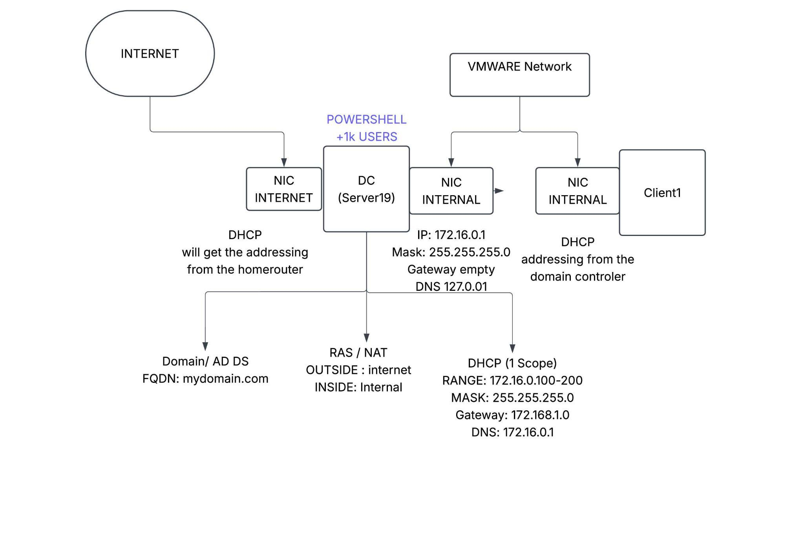

## Description

This project is a walkthrough of how I (Ali Alasfour) built an Active Directory home lab environment using VMware. I configured a Microsoft Server virtual machine to run Active Directory and then configured it as a Domain Controller to create and manage a domain.

After configuring the Domain Controller, I used a PowerShell script to create more than **1,000 user accounts** in Active Directory. I then created a second virtual machine to act as a client computer and joined it to the domain, allowing me to test logging into the newly created accounts and accessing the internet through the Domain Controller.

This lab simulates a small business environment and demonstrates how Active Directory, DHCP, DNS, NAT, and PowerShell work together in a Windows network environment.

### Requirements

- Microsoft Server 2019 ISO
- Windows 10 Enterprise ISO
- VMware
- PowerShell script (included in this repo — `CREATE_USERS.ps1`)

## Languages and Utilities Used

- **Active Directory**
- **PowerShell**
- **Command Prompt (CMD)**

## Environments Used

- **VMware**
- **Microsoft Server 2019**
- **Windows 10 (21H2)**

## Links

- **VMware:** <https://www.vmware.com/products/workstation-player/workstation-player-evaluation.html>
- **Microsoft Server 2019:** <https://www.microsoft.com/en-us/evalcenter/download-windows-server-2019>
- **Windows 10 ISO:** <https://www.microsoft.com/en-us/software-download/windows10>

---

## Program Walk-Through

For the domain controller, I hosted it on a Windows Server 2019 VM using two network adapters: one on NAT so the VM can reach the internet through the home router, and one on an internal network to communicate with the Windows 10 client VM.

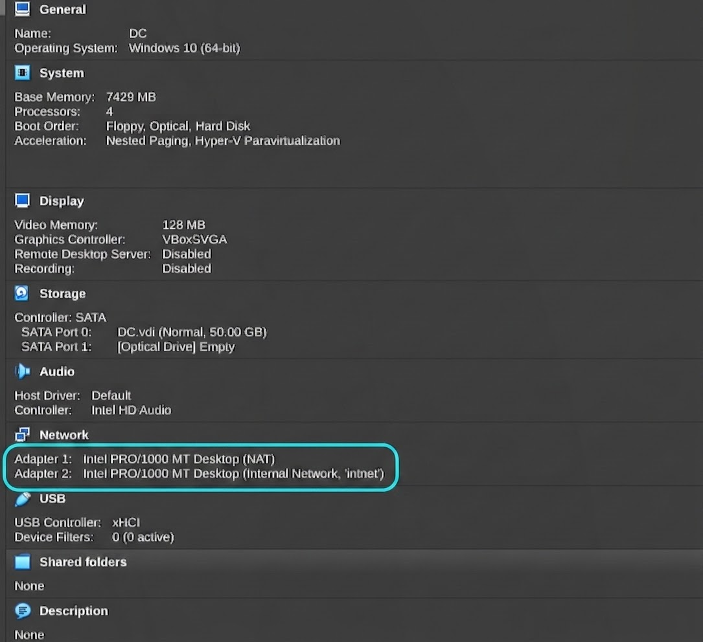

### Configuring the Network Adapters

After installing Windows Server 2019 on the virtual machine, the first step is configuring the two network adapters — one used as the external NIC, the other as the internal NIC.

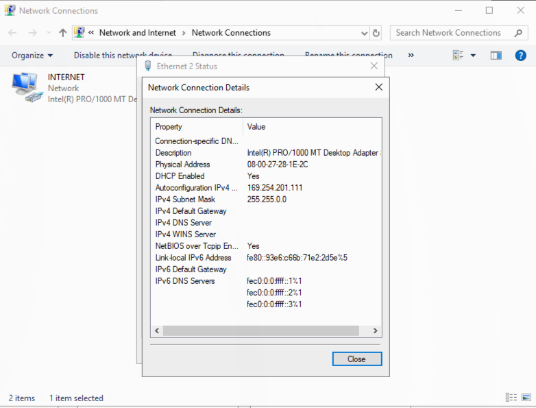

The internal adapter is identifiable by its DHCP-failure IPv4 address, which always starts with `169.254.x.x`, so I named it **INTERNAL**.

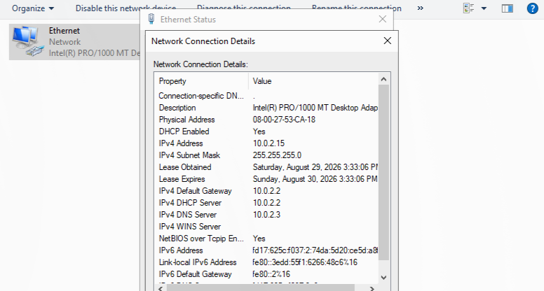

The other adapter has a private IP address, indicating it's the NAT connection, so I named it **INTERNET**.

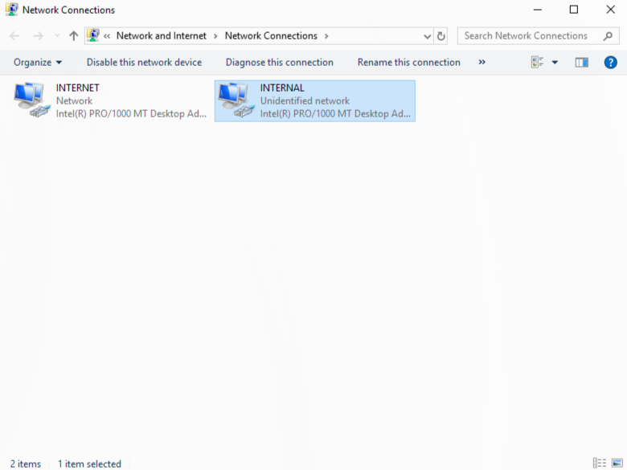

Renaming the adapters makes them easier to identify later and saves time when troubleshooting.

### Configuring the Internal Network

Next, I configured the internal network based on the IP scheme above — the IPv4 address for the Domain Controller is **172.16.0.1**. Since installing Active Directory also installs DNS, I used the loopback address so the server can resolve itself.

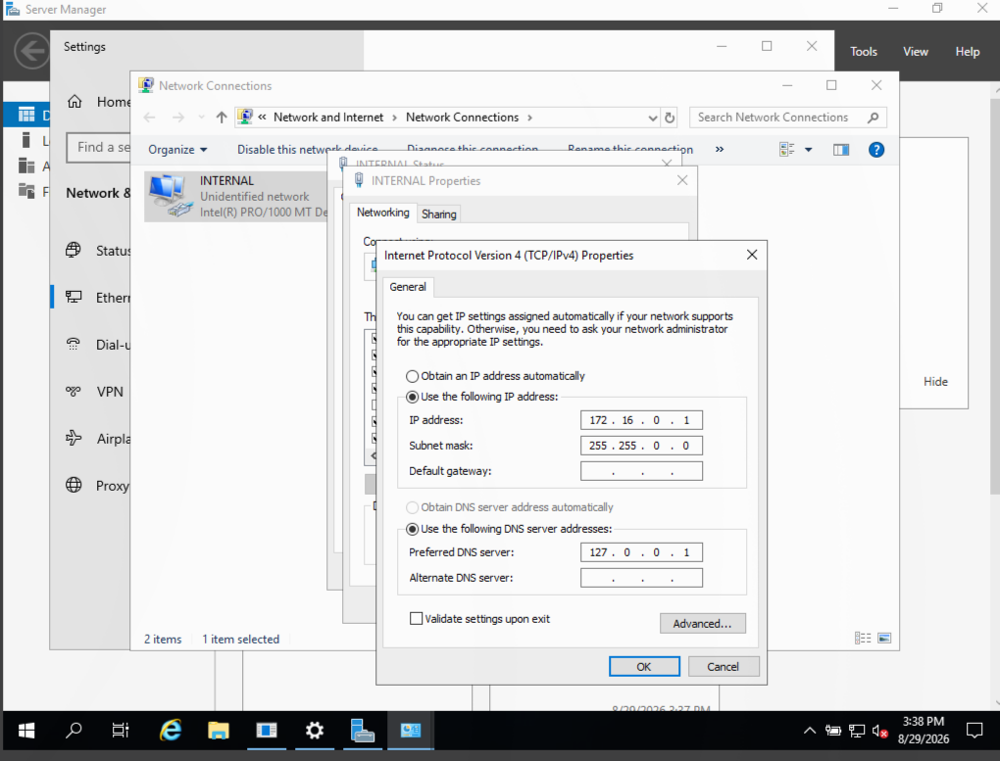

### Renaming the Domain Controller

After renaming the network adapters, I renamed the computer from its default "number salad" name to **DC** (Domain Controller). Renaming the computer required a restart.

## Creating the Domain

With Active Directory Domain Services installed, the next step is promoting the server to a Domain Controller and creating the domain.

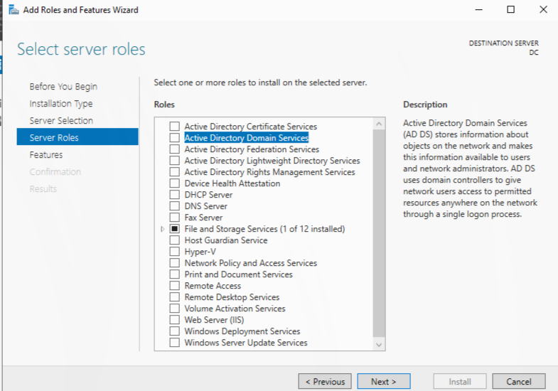

Promotion requires a restart. After logging back in, I verified the domain was created successfully — my administrator account now shows **MYDOMAIN** in front of the account name.

## Creating a Dedicated Domain Administrator

Instead of continuing to use the built-in Administrator account, I created a dedicated domain administrator account for myself, Ali Alasfour.

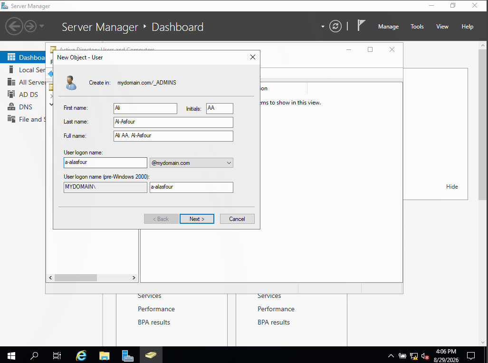
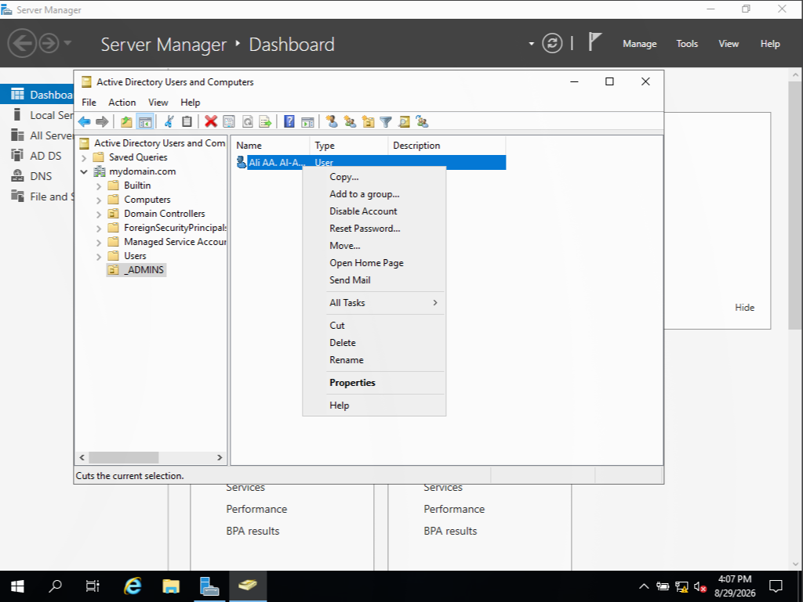

The new account didn't have administrator privileges by default, so I used Active Directory to add it to the appropriate admin group. I then logged out of the built-in Administrator account and into my new Domain Administrator account.

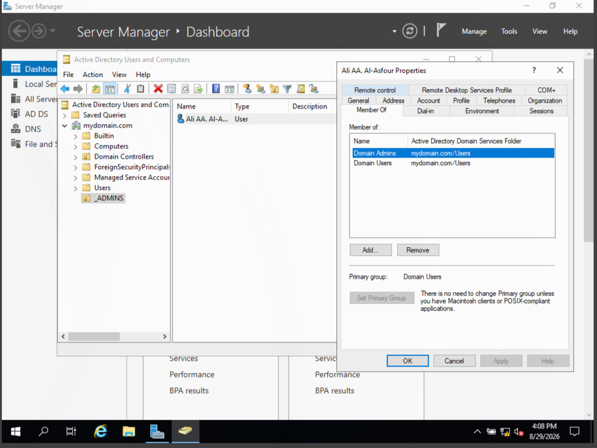

## Installing and Configuring RAS/NAT

Next, I installed and configured Routing and Remote Access Service (RAS/NAT) so the Windows 10 client can reach the internet through the internal network and the Domain Controller.

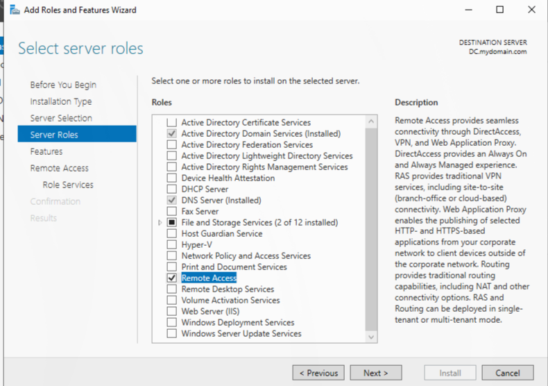

After the role is installed, I configured Routing and Remote Access.

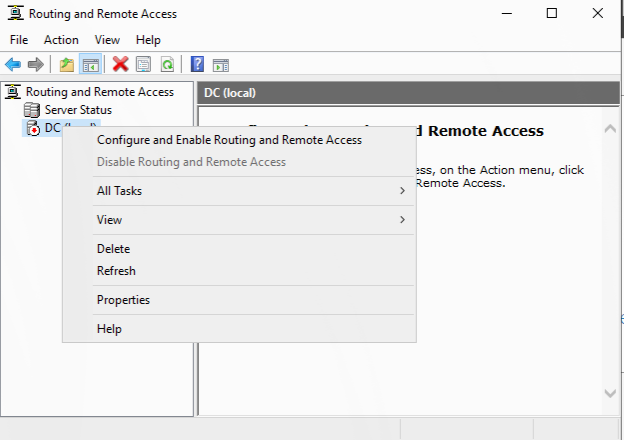
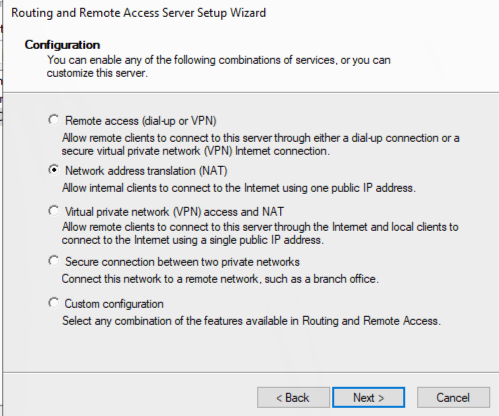

Once Remote Access is installed and configured, the Domain Controller can provide network connectivity to the internal client machine.

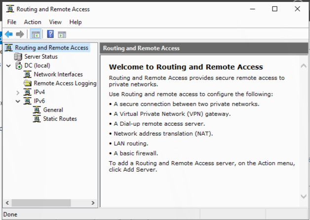

## Installing and Configuring DHCP

Next, I installed a DHCP Server so devices on the network automatically receive an IP address, letting the Windows 10 client communicate internally and browse the internet through the Domain Controller.

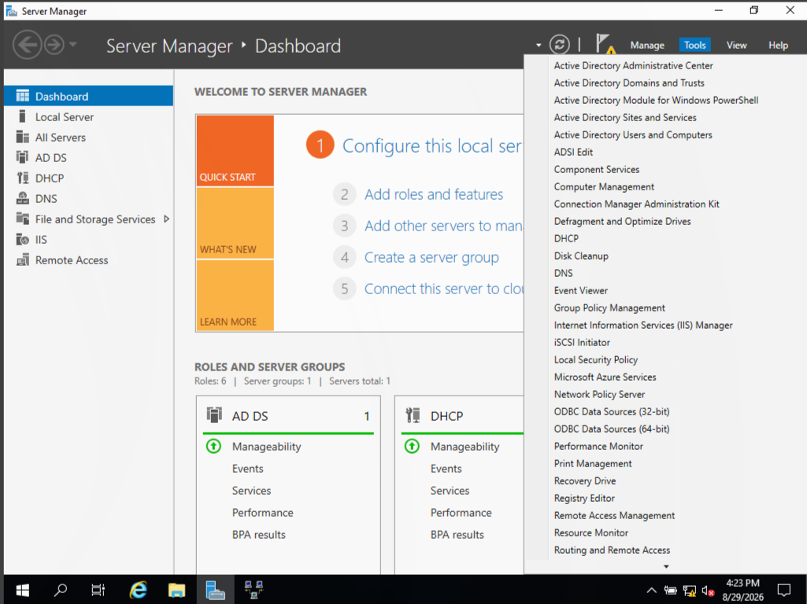

### Creating the DHCP Scope

I configured DHCP and created a scope that assigns IP addresses in the range **172.16.0.100 – 172.16.0.200**, giving roughly 100 addresses for the server to hand out.

I also set the IP address lease duration to **20 days**.

An IP lease determines how long a device can keep an assigned address before it becomes available for reuse — while a device holds the lease, it can't be assigned to anyone else.

For example, if a café had only 100 available addresses and 100 connected customers, new devices couldn't get an address until existing leases expired or were released. If the average customer only stayed for about two hours, a 20-day lease would make no sense — the address would stay locked up long after the customer left. In that kind of environment, a much shorter lease (a few hours) plus a larger address pool would make more sense. Since this project runs in an isolated virtual lab, the 20-day lease isn't a real concern here.

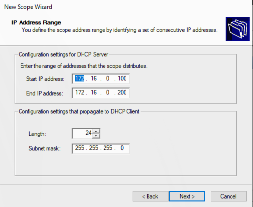
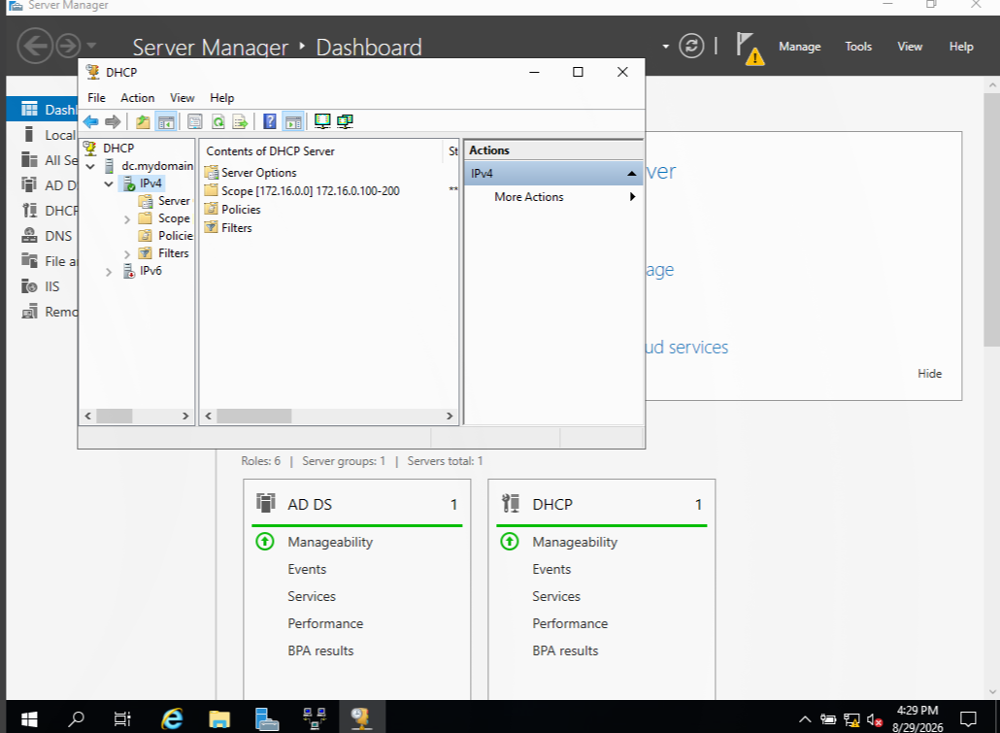

---

## Bulk User Creation With PowerShell

With Active Directory and the Domain Controller configured, I used a PowerShell script to create more than **1,000 user accounts** in Active Directory.

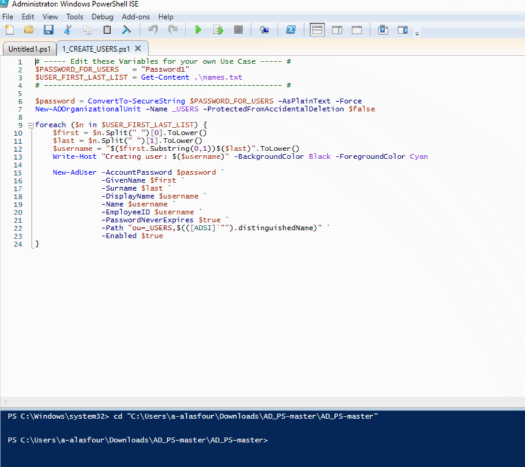

The script runs successfully, and the console output confirms the accounts were created.

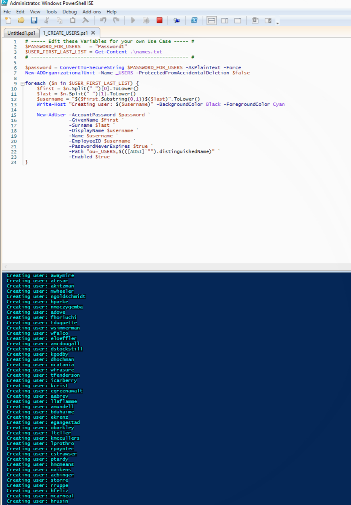

A handful of duplicate usernames aren't created by the script. This could be fixed by adding logic to the script that appends a number to the username whenever a duplicate is detected.

The complete PowerShell script used for this project is in this repository as [`CREATE_USERS.ps1`](CREATE_USERS.ps1).

Here are the resulting user accounts in Active Directory:

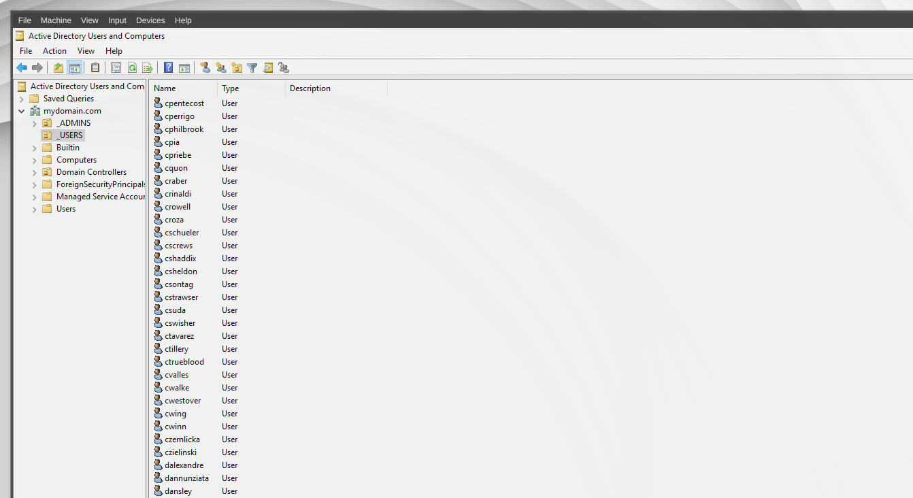

### Running it yourself

```powershell
# 1. Edit the variables at the top of CREATE_USERS.ps1:
#    - $PASSWORD_FOR_USERS : the password assigned to every created account
#    - $USER_FIRST_LAST_LIST : reads from names.txt (one "First Last" name per line)

# 2. Run it from an elevated PowerShell session on the Domain Controller:
.\CREATE_USERS.ps1
```

The script reads each `First Last` name from `names.txt`, builds a username in the format `flast` (first initial + last name, lowercased), and creates the corresponding AD user inside a new `_USERS` organizational unit.

---

## Creating the Client Virtual Machine

Next, I created a new virtual machine to act as a user's computer on the domain, named **CLIENT1**.

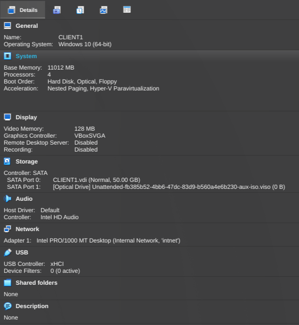

### Configuring the Client Network

I configured the client's network adapter so it does **not** use NAT to reach the internet directly through my local network. The only way this VM should reach the internet is by receiving an IP address from the Domain Controller and routing its traffic through the server — so I set CLIENT1 to use the same internal network as the Domain Controller.

## Joining CLIENT1 to the Domain

After setting up the client VM to simulate an employee's computer, I renamed it **CLIENT1** and joined it to the **mydomain.com** domain, authenticating with the Administrator account I configured earlier.

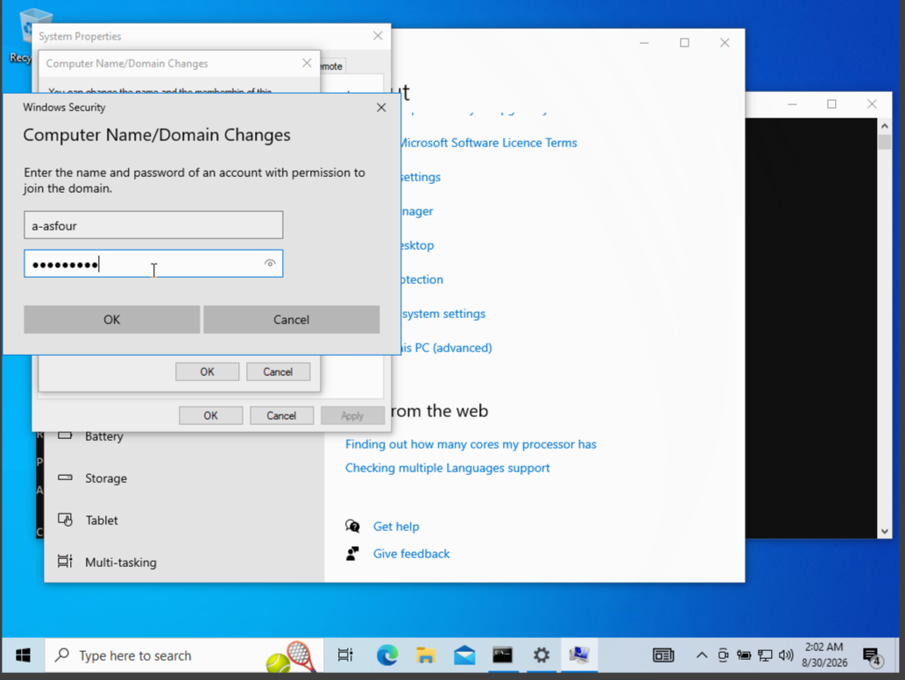

The computer joins the domain successfully.

### Verifying the IP Address and Domain Connection

Using Command Prompt, I verified the client is receiving its IP address correctly from the Domain Controller and can successfully ping the domain, confirming connectivity.

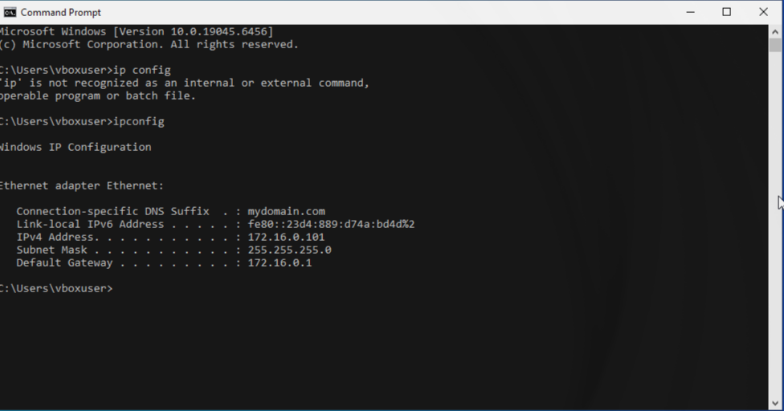

## Verifying Computers in Active Directory

Active Directory also shows which computers are connected to the domain. **CLIENT1** appears there, confirming it has successfully joined and is recognized by the domain. In a real business environment, this list could contain hundreds or thousands of computers depending on the size of the organization.

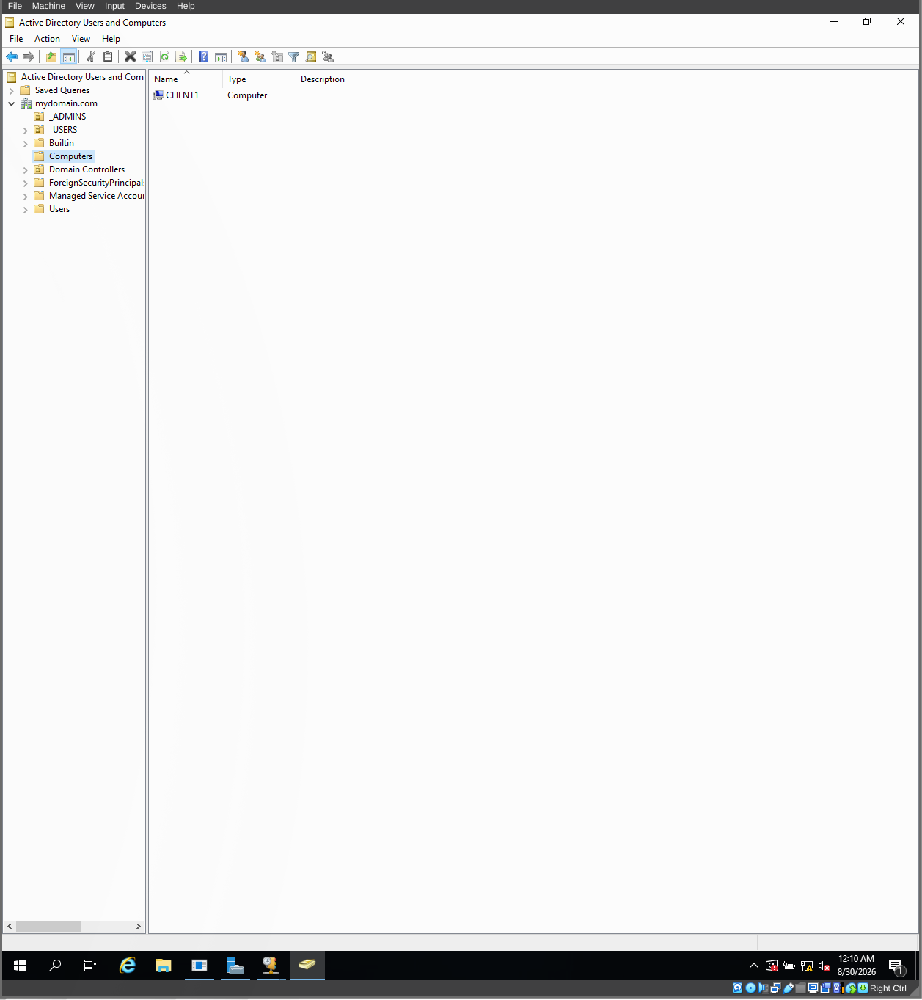

---

## Conclusion

This project demonstrates how I (Ali Alasfour) built a functional Active Directory home lab using VMware, Windows Server 2019, and Windows 10.

The lab covered configuring a Domain Controller, Active Directory Domain Services, DNS, DHCP, and Routing and Remote Access/NAT, and used PowerShell to automate the creation of more than 1,000 Active Directory user accounts.

Finally, I created a Windows 10 client machine, connected it to the internal network, joined it to the domain, and tested logging into one of the accounts created by the PowerShell script.

Overall, this lab simulates several of the technologies and processes used in a real business environment, while providing a controlled space for learning and practicing Active Directory administration.

## Repository Contents

| File | Description |
|---|---|
| [`README.md`](README.md) | This walkthrough |
| [`CREATE_USERS.ps1`](CREATE_USERS.ps1) | PowerShell script for bulk AD user creation |
| [`names.txt`](names.txt) | Sample list of first/last names used to generate bulk test accounts |
| `images/` | Screenshots referenced throughout this walkthrough |
# AD_POWERSHELL_W19
# AD_POWERSHELL_W19
